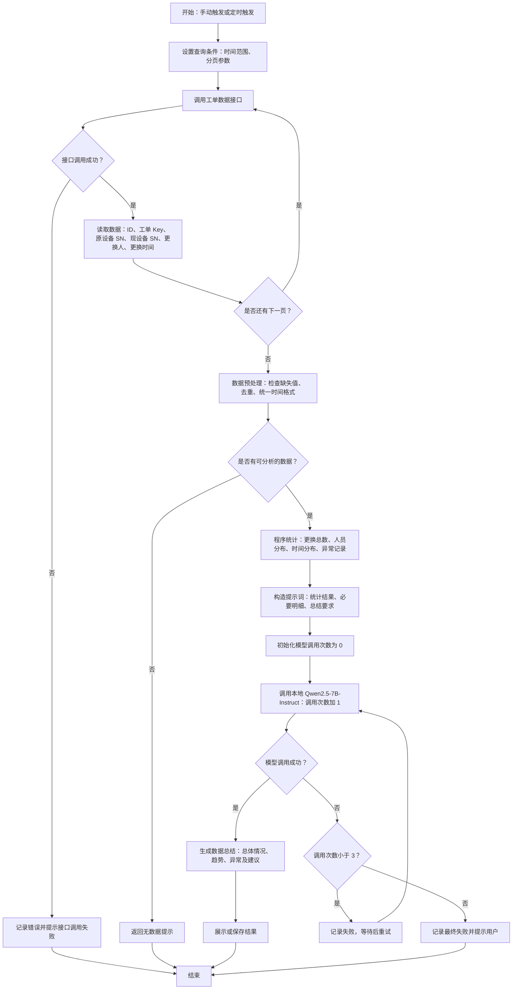

# 工单数据总结工作流程

系统读取工单接口数据，完成清洗和统计后，调用本地 Qwen2.5-7B-Instruct 生成总结。模型调用最多尝试三次（包含首次调用）。

```mermaid
flowchart TD
    A[开始：手动触发或定时触发] --> B[设置查询条件：时间范围、分页参数]
    B --> C[调用工单数据接口]
    C --> D{接口调用成功？}
    D -- 否 --> E[记录错误并提示接口调用失败]
    E --> Z[结束]
    D -- 是 --> F[读取数据：ID、工单 Key、原设备 SN、现设备 SN、更换人、更换时间]
    F --> G{是否还有下一页？}
    G -- 是 --> C
    G -- 否 --> H[数据预处理：检查缺失值、去重、统一时间格式]
    H --> I{是否有可分析的数据？}
    I -- 否 --> J[返回无数据提示]
    J --> Z
    I -- 是 --> K[程序统计：更换总数、人员分布、时间分布、异常记录]
    K --> L[构造提示词：统计结果、必要明细、总结要求]
    L --> M[初始化模型调用次数为 0]
    M --> N[调用本地 Qwen2.5-7B-Instruct：调用次数加 1]
    N --> O{模型调用成功？}
    O -- 是 --> P[生成数据总结：总体情况、趋势、异常及建议]
    P --> Q[展示或保存结果]
    Q --> Z
    O -- 否 --> R{调用次数小于 3？}
    R -- 是 --> S[记录失败，等待后重试]
    S --> N
    R -- 否 --> T[记录最终失败并提示用户]
    T --> Z
```

- 模型调用最多三次：首次调用失败后，最多再重试两次。
- 三次均失败时结束本次任务，并返回失败提示。
- 数据量较大时，可分批总结后再汇总。
